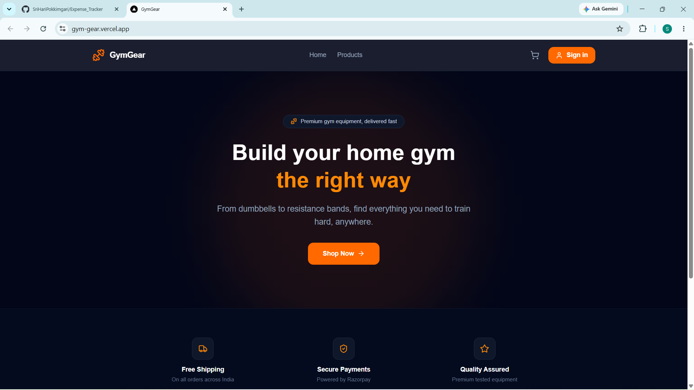
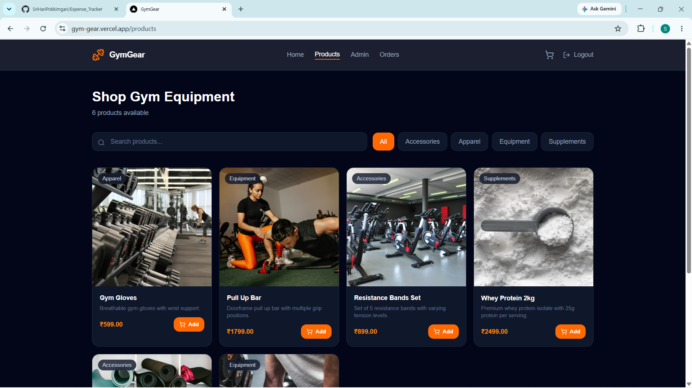
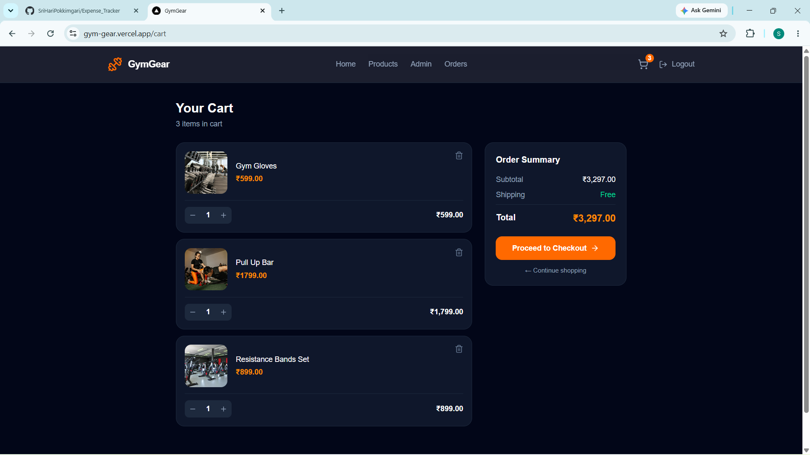
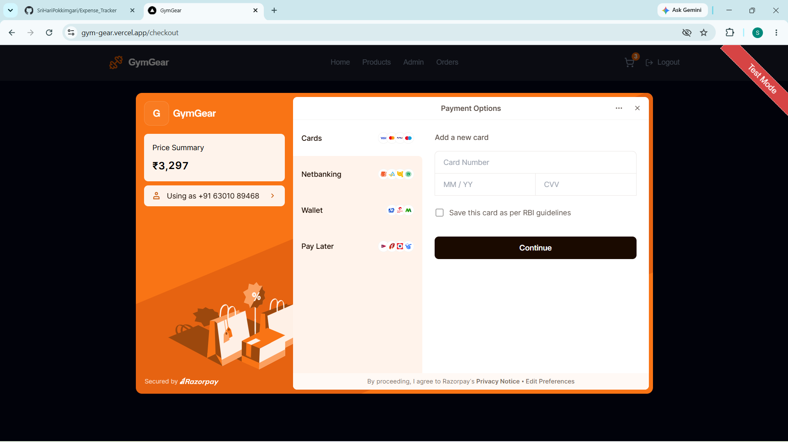
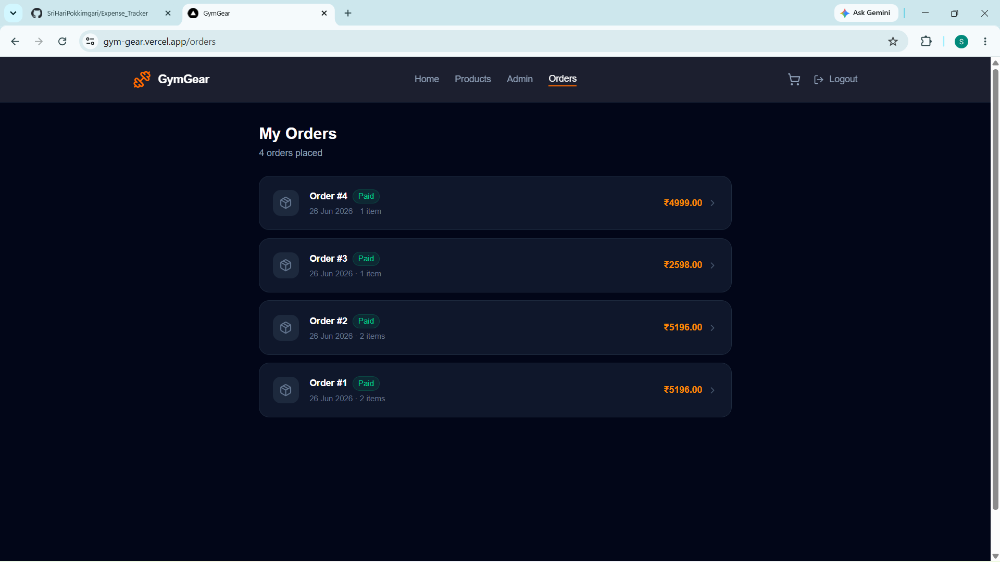
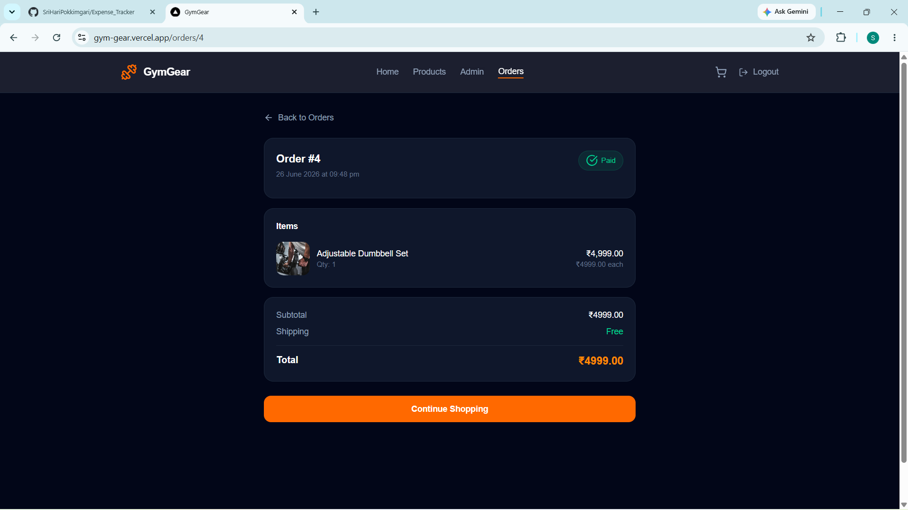
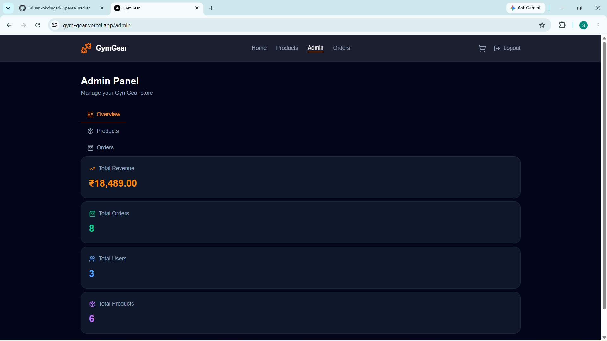
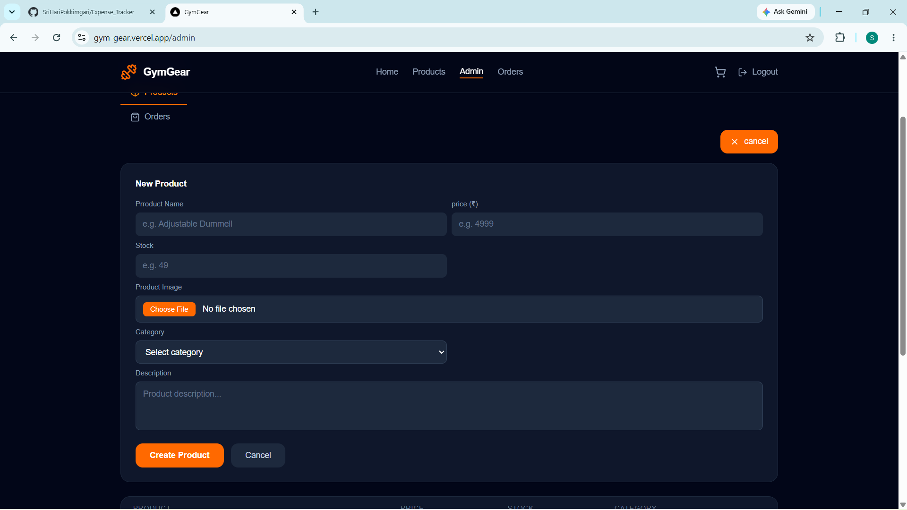

# 🏋️ GymGear

A full stack e-commerce store for gym equipment built with Next.js 15, TypeScript, and PostgreSQL. Features a complete shopping experience with real payment integration, production-grade authentication, and an admin panel for store management.

🌐 **Live Demo:** [gym-gear.vercel.app](https://gym-gear.vercel.app)
⚙️ **GitHub:** [github.com/SriHariPokkimgari](https://github.com/SriHariPokkimgari)

---

## 📸 Screenshots

### Landing Page



### Products



### Cart



### Razorpay Checkout



### Orders



### Order Detail



### Admin Panel — Overview



### Admin Panel — Products



---

## ✨ Features

### Shopping

- 🛍️ Product listing with search and category filters
- 📦 Product detail page with stock indicator and quantity selector
- 🛒 Database-backed cart — persists across devices and sessions
- 💳 Real payment integration with Razorpay (Cards, UPI, Netbanking, Wallets)
- 📋 Order history with status tracking
- ✅ Order confirmation with itemized receipt

### Authentication

- 🔐 JWT authentication with access tokens (15 min) and refresh tokens (30 days)
- 🔄 Silent token refresh — users never get logged out unexpectedly
- 🔑 Google OAuth — one-click sign in
- 📧 Forgot password with email reset link
- 🔒 Secure httpOnly cookie storage

### Admin Panel

- 📊 Dashboard — total revenue, orders, users, products
- ➕ Add, edit, delete products with Cloudinary image upload
- 📦 View all orders with customer details
- 🔄 Update order status (pending → paid → cancelled)
- 🛡️ Role-based access control — admin only

### Technical

- 📱 Fully responsive — mobile, tablet and desktop
- 🌐 Next.js App Router with API routes (no separate backend)
- 🔒 Protected routes with auth middleware
- 📷 Image uploads via Cloudinary
- 🗃️ Relational database with 8 tables

---

## 🛠️ Tech Stack

### Frontend


- Next.js 15 (App Router)
- TypeScript
- Tailwind CSS
- Axios with interceptors
- Lucide React icons

### Backend


- Next.js API Routes
- PostgreSQL (Neon)
- JWT (access + refresh tokens)
- bcrypt password hashing
- Nodemailer (email)

### Services


- Vercel (deployment)
- Razorpay (payments)
- Cloudinary (image storage)
- Google OAuth (authentication)
- Neon (PostgreSQL database)

---

## 🗄️ Database Schema

```sql
users          — id, name, email, password, role, google_id
categories     — id, name, image_url
products       — id, name, description, price, stock, image_url, category_id
orders         — id, user_id, total_amount, status, stripe_payment_id
order_items    — id, order_id, product_id, quantity, price
carts          — id, user_id
cart_items     — id, cart_id, product_id, quantity
refresh_tokens — id, user_id, token, expires_at
password_reset_tokens — id, user_id, token, expires_at, used
```

---

## 📡 API Routes

### Auth

| Method | Endpoint                    | Description                     |
| ------ | --------------------------- | ------------------------------- |
| POST   | `/api/auth/register`        | Create new account              |
| POST   | `/api/auth/login`           | Login with email/password       |
| POST   | `/api/auth/logout`          | Logout and revoke refresh token |
| POST   | `/api/auth/refresh`         | Get new access token            |
| GET    | `/api/auth/me`              | Get current user                |
| GET    | `/api/auth/google`          | Initiate Google OAuth           |
| GET    | `/api/auth/google/callback` | Google OAuth callback           |
| POST   | `/api/auth/forgot-password` | Send reset email                |
| POST   | `/api/auth/reset-password`  | Reset password with token       |

### Products

| Method | Endpoint            | Description                             |
| ------ | ------------------- | --------------------------------------- |
| GET    | `/api/products`     | Get all products (with search + filter) |
| GET    | `/api/products/:id` | Get single product                      |
| POST   | `/api/products`     | Create product (admin)                  |
| PUT    | `/api/products/:id` | Update product (admin)                  |
| DELETE | `/api/products/:id` | Delete product (admin)                  |

### Cart

| Method | Endpoint           | Description               |
| ------ | ------------------ | ------------------------- |
| GET    | `/api/cart`        | Get user's cart           |
| POST   | `/api/cart/add`    | Add item to cart          |
| PUT    | `/api/cart/update` | Update item quantity      |
| DELETE | `/api/cart/remove` | Remove item from cart     |
| POST   | `/api/cart/merge`  | Merge guest cart on login |

### Orders & Checkout

| Method | Endpoint               | Description                   |
| ------ | ---------------------- | ----------------------------- |
| GET    | `/api/orders`          | Get user's orders             |
| GET    | `/api/orders/:id`      | Get order details             |
| POST   | `/api/checkout`        | Create Razorpay order         |
| POST   | `/api/checkout/verify` | Verify payment + update order |

### Admin

| Method | Endpoint                | Description                   |
| ------ | ----------------------- | ----------------------------- |
| GET    | `/api/admin/stats`      | Dashboard stats               |
| GET    | `/api/admin/products`   | All products                  |
| GET    | `/api/admin/orders`     | All orders with customer info |
| PUT    | `/api/admin/orders/:id` | Update order status           |
| POST   | `/api/upload`           | Upload image to Cloudinary    |

---

## 🚀 Run Locally

### Prerequisites

- Node.js v18+
- PostgreSQL or Neon account
- Razorpay test account
- Cloudinary account
- Google OAuth credentials

### Clone the repo

```bash
git clone https://github.com/SriHariPokkimgari/Gym_gear.git
cd gymgear
npm install
```

### Create `.env.local`

```env
NEON_DATABASE_URL=your_postgresql_connection_string
JWT_ACCESS_SECRET=your_access_token_secret
JWT_REFRESH_SECRET=your_refresh_token_secret
GOOGLE_CLIENT_ID=your_google_client_id
GOOGLE_CLIENT_SECRET=your_google_client_secret
NEXT_PUBLIC_GOOGLE_CLIENT_ID=your_google_client_id
RAZORPAY_KEY_ID=rzp_test_xxxxx
RAZORPAY_KEY_SECRET=xxxxx
CLOUDINARY_CLOUD_NAME=your_cloud_name
NEXT_PUBLIC_CLOUDINARY_CLOUD_NAME=your_cloud_name
CLOUDINARY_API_KEY=your_api_key
CLOUDINARY_API_SECRET=your_api_secret
EMAIL_USER=your_gmail@gmail.com
EMAIL_PASS=your_gmail_app_password
NEXT_PUBLIC_API_URL=http://localhost:3000
```

### Set up database

Run the SQL from `/database/schema.sql` in your PostgreSQL instance.

### Start the app

```bash
npm run dev
```

Visit `http://localhost:3000`

### Make yourself admin

```sql
UPDATE users SET role = 'admin' WHERE email = 'your@email.com';
```

---

## 📁 Project Structure

```
gymgear/
├── app/
│   ├── api/                    ← All backend API routes
│   │   ├── auth/               ← Login, register, OAuth, refresh, reset
│   │   ├── products/           ← CRUD product routes
│   │   ├── cart/               ← Cart management
│   │   ├── orders/             ← Order history
│   │   ├── checkout/           ← Razorpay integration
│   │   ├── admin/              ← Admin-only routes
│   │   ├── categories/         ← Category listing
│   │   └── upload/             ← Cloudinary upload
│   ├── products/               ← Products listing + detail pages
│   ├── cart/                   ← Cart page
│   ├── checkout/               ← Checkout page
│   ├── orders/                 ← Orders history + detail
│   ├── admin/                  ← Admin panel
│   ├── login/                  ← Login page
│   ├── register/               ← Register page
│   ├── forgot-password/        ← Forgot password page
│   ├── reset-password/         ← Reset password page
│   └── page.tsx                ← Landing page
├── components/
│   ├── Navbar.tsx
│   └── ProductCard.tsx
├── context/
│   ├── AuthContext.tsx         ← Auth state + Google OAuth merge
│   └── CartContext.tsx         ← Cart state (DB + guest localStorage)
├── lib/
│   ├── db.ts                   ← PostgreSQL connection
│   ├── auth.ts                 ← JWT sign/verify helpers
│   ├── middleware.ts            ← Auth + admin middleware
│   ├── cloudinary.ts           ← Cloudinary config
│   ├── google.ts               ← Google OAuth helpers
│   ├── mailer.ts               ← Nodemailer email setup
│   └── axios.ts                ← Axios with refresh interceptor
├── hooks/
│   └── useRequireAuth.ts       ← Protect pages from unauthenticated access
└── types/
    └── index.ts                ← TypeScript interfaces
```

---

## 🔐 Auth Flow

```
Register/Login → Access Token (15 min) + Refresh Token (30 days)
                        ↓
              Access token expires
                        ↓
         Axios interceptor catches 401
                        ↓
        Silent refresh → new access token
                        ↓
         Original request retried ✅
```

---

## 💳 Payment Flow

```
Add to cart → Checkout → Razorpay modal opens
                              ↓
              Complete payment (card/UPI/netbanking)
                              ↓
         Razorpay calls handler with payment ID
                              ↓
        Backend verifies signature → updates order
                              ↓
           Stock reduced → cart cleared → success page ✅
```

---

## 👨‍💻 Author

**Sri Hari Pokkimgari**

[](https://github.com/SriHariPokkimgari)
[](https://linkedin.com/in/srihari-pokkimgari-0a874130a)

---

## 📄 License

This project is open source and available under the [MIT License](LICENSE).

---

⭐ If you found this project helpful, please give it a star!
